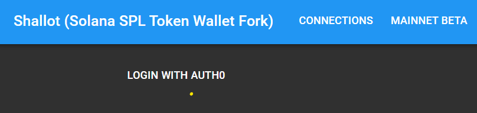
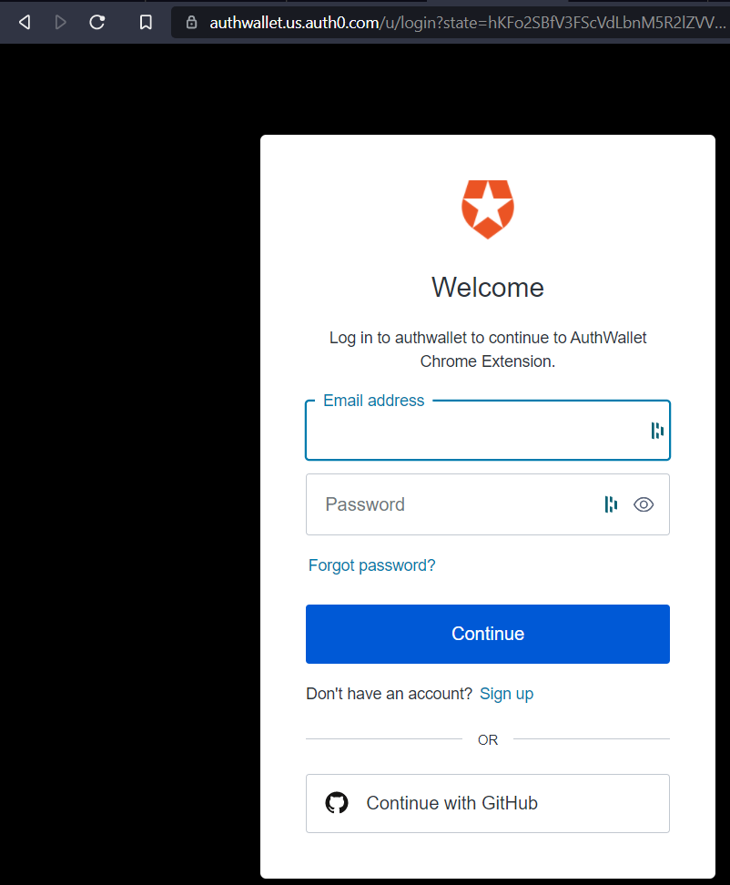
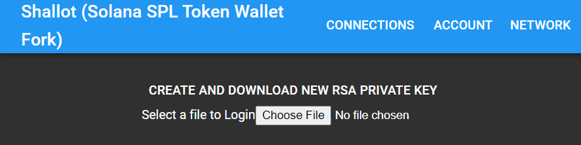
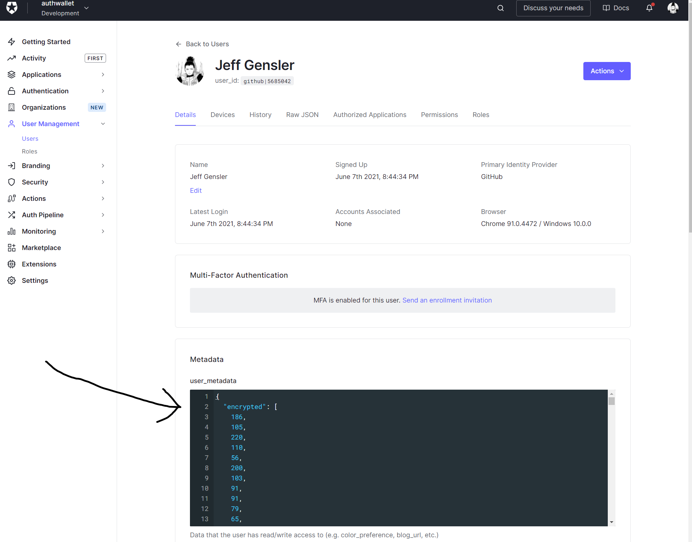
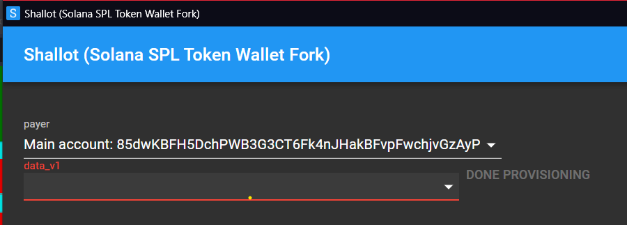

# Shallot (Hackathon Entry)

While the current SPL token wallet provides a Metamask-like experience on Solana, Solana's programming and account model to not map 1:1 to the Ethereum ecosystem. Instead, Accounts are created per-application and data for the respecitve application is stored in a single account. Applications may even requrie multiple Accounts for increased storage or simplicity in Account layouts (like migrating a schema from V1 to V2).

Shallot aims to provide a "Proof of Concept" for a more advanced API layer that wallets should support to enable account management.

Example: [Mango Markets initMarginAccount](https://github.com/blockworks-foundation/mango-ui-v2/blob/f827718f507600691079476d1f2a406a095a69cf/utils/mango.tsx#L58-L102). In this code, `createAccountInstruction` ends up calling `new Account()` but the private key of this accounnt is lost forever after this function returns the `accInstr.account.publicKey`. While associations between Payers and "data" accounts may exist, it is possible to change over time and signing transactions with the private key of the data account owner is sure to prove "ownership" over the data account.

Shallot aims to store both "friendly" names and private keys for both payer and data accounts.

---

## What is Working

* remote storage w/ encryption key. If you trust encryption, you may as well store encrypted data on Solana instead of a third party like Auth0. Another alternative is to save this metadata locally once a change is made though this may prove cumbersome. Customers are already expected to do so with their mnemonic which 

<details>
  <summary>Click to expand screenshots</summary>

1. login with Auth0



2. sign in with social account/email account



3. compelete sign in with encryption key



4. view of data on Auth0 side



</details>

* initial account storage model

```
let accounts = {
    mnemonic: "",
    seed: "",
    names: ["payer", "mango_data", "some_other_app", ""]
}
```

The data model above shows that there are three accounts that derive from the mnemonic and seed (though this assumes a well-known derivation path)

Another place an assumption on the number of derived accounts can be found is [when importing private key in the spl-token-wallet](https://github.com/project-serum/spl-token-wallet/blob/958cf5df7a6afe417354cac14c353b52e1b8d6d4/src/pages/LoginPage.js#L423-L429). If we anticipate the Solana ecosystem growing (someone using more than 10+ applications), any assumption on the number of accounts or the choice of derived accounts (vs new mnemonic) will not be sufficient. No customer will remeber that the fourth account they provisioned was for XYZ token exchange.

The data model I suggest here is also not likely to represent a customer. There are hardware wallets and multiple mneumonic/seeds used. Management of these keys is complicated and a customer isn't likely to save even 2/3 files. I think this presents a good opportunity for wallet providers yet adds complexity and uncertainty to application developers.

* `connectProvision` API call. As a wallet provider, 

```node
import {Wallet} from "spl_token_wallet"

// Request:
const wallet = new Wallet();
wallet.connectProvision({
    accounts: ["payer", "data_v1"]
})

// Response:
wallet.on('connectProvision', (accounts) => console.log(accounts))

{
    keys: {
        payer: <web3.PublicKey>,
        data_v1: <web3.PublicKey>,
    }
}
```

Provision UI:



---

## What work is left?

* spl-token-wallet multi-account-sign: currently, spl-token-wallet has a "selected" account used for signing (`const wallet = useWallet()`). While Metamask can provide the idea of a "selected" wallet, not all applications in the Solana ecosystem will work with a single payer account. Even "presets" of accounts might be worth naming (my_login_1 = payer_1, account_0, my_login_2= payer_2, account_0)
* Suggestions on Nomenclature/domain modeling: "naming things" is known to be difficult and, in my opinion, it is difficult to read code where every library has an "Account" or "Wallet" structure. For example, Solana's web3.js, Anchor's TypeScript library, spl-token-wallet, and sol_wallet_adapter all have varying API calls and variable naming. `Sign`, `SignTransaction`, `partialSign` are also present on a few of these library. From the Application point-of-view, Wallets sign transactions. At the same time, the web3.js library has transactions signed by private keys. I suppose this API might standardize over time but it would be nice to decide on interface between the web-application layer and the wallet layer to provide some stability and feature compatibility between wallets. This might mean moving classes from the spl_token_wallet into the web3.js library and defining what it means to be a Solana "Wallet."